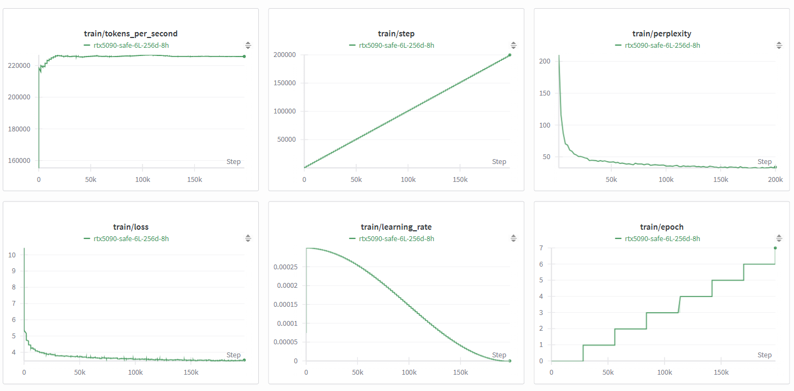

# GPT-2 Training on RTX 5090: Performance Analysis

**Author**: Aditya Bhatt

## Abstract

This study documents the implementation and performance characteristics of GPT-2 training on RTX 5090 hardware using mixed precision training. A 25M parameter model was trained on WikiText-103 for 5 hours, achieving a final validation perplexity of 31.4. Key bottlenecks identified include insufficient model capacity, premature learning rate decay, and data pipeline inefficiencies that limited GPU utilization.

## Experimental Setup

**Model Configuration**:
- Parameters: 25M (6 layers, 256d embedding, 8 heads)
- Context Length: 512 tokens
- Mixed Precision: FP16 with GradScaler
- Dataset: WikiText-103-raw-v1

**Training Configuration**:
- Batch Size: 16
- Learning Rate: 3e-4 with cosine decay
- Max Steps: 200,000 (5-hour limit)
- Hardware: RTX 5090

## Results

### Training Metrics
- Final validation loss: 3.45
- Final validation perplexity: 31.4
- Training throughput: 220,000 tokens/second
- Training stability: Smooth convergence

### Sample Generation
**Prompt**: "The future of artificial intelligence"

**Output**: "was the same .= = = Microbiology = = =Some studies have been conducted to see what evolutionary biologists believed to be extremely low @-@ speed fossil destruction..."

### Training Dynamics

## Identified Bottlenecks

### Model Capacity Limitations
- 25M parameters insufficient for WikiText-103 complexity
- Generated text shows repetitive patterns and semantic drift
- Context window of 512 tokens limits long-range modeling

### Optimization Issues
- Learning rate decayed to near-zero by step 200k
- Cosine schedule too aggressive for training duration
- Batch size underutilized RTX 5090 memory capacity

### Data Pipeline Problems
- Sliding window with 50% overlap creates train/validation leakage
- Unfiltered Wikipedia articles introduce noise
- CPU preprocessing becomes bottleneck at scale

### Computational Bottlenecks
- Model too small to saturate RTX 5090 compute units
- Frequent checkpoint saves cause training interruptions
- O(n²) attention scaling limits sequence length scaling

## Conclusion

Mixed precision training was successfully implemented, but the 25M parameter model represents a fundamental capacity bottleneck. Future iterations require scaling to 100M+ parameters with improved data handling and learning rate scheduling to fully utilize RTX 5090 capabilities. The current setup achieves stable training but insufficient model quality for practical applications.